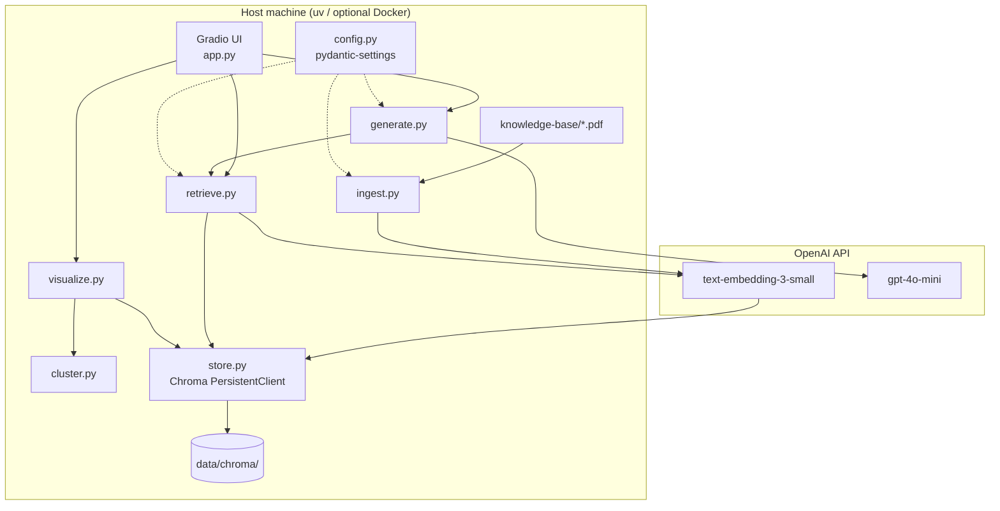
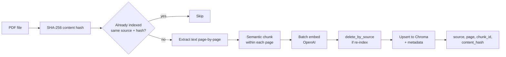
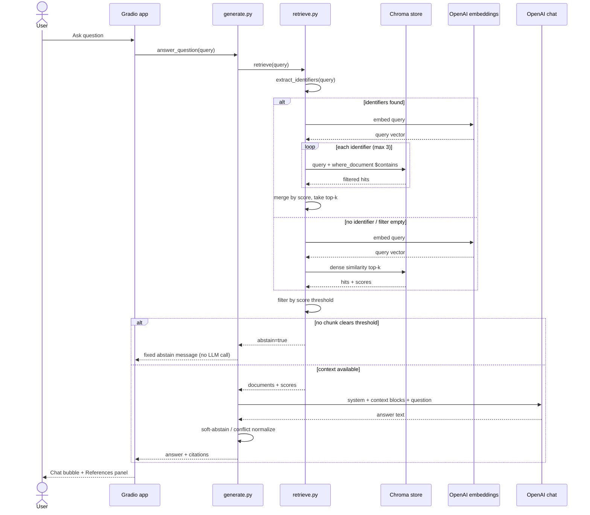
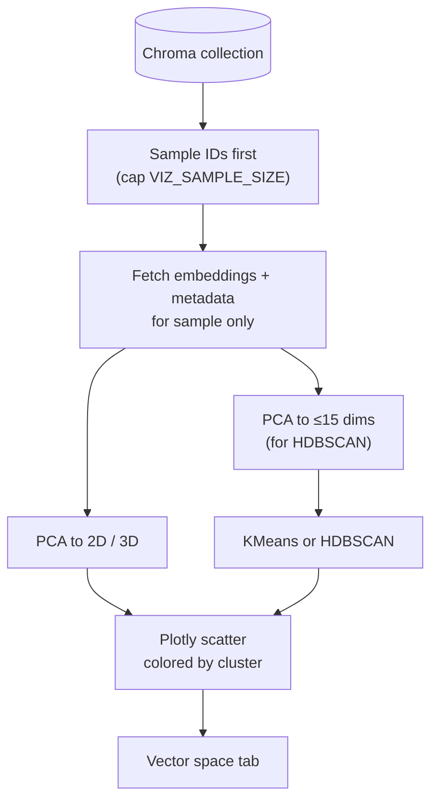
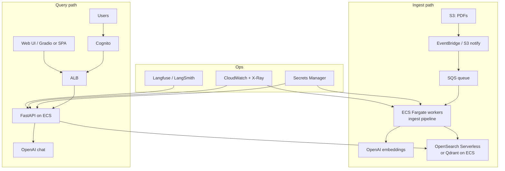
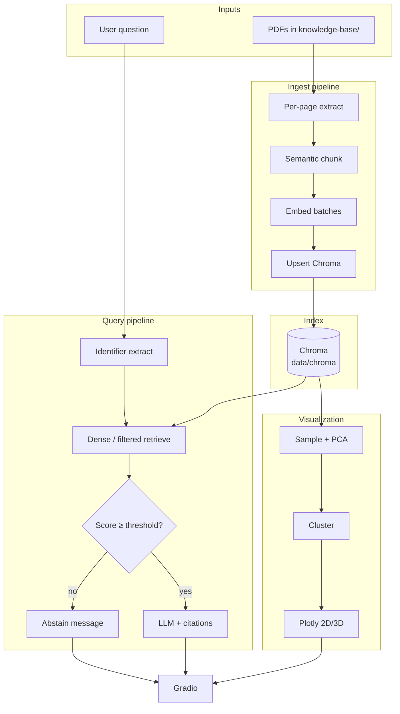

# Design and Decisions: Chat With Your Docs

## Table of contents

1. [Quick setup](#1-quick-setup)
2. [Architecture overview](#2-architecture-overview)
3. [Productionizing on a hyper-scaler](#3-productionizing-on-a-hyper-scaler)
4. [RAG / LLM approach and decisions](#4-rag--llm-approach-and-decisions)
5. [Key technical decisions](#5-key-technical-decisions)
6. [Engineering standards (followed and skipped)](#6-engineering-standards-followed-and-skipped)
7. [How AI tools were used](#7-how-ai-tools-were-used)
8. [What I'd do differently with more time](#8-what-id-do-differently-with-more-time)

---

## 1. Quick setup

**Local development uses `uv` only.** Docker Compose is for production-style packaging, not day-to-day work (it burns more CPU/RAM than needed for a laptop loop).

### Prerequisites

- Python 3.11+ and [uv](https://github.com/astral-sh/uv)
- An OpenAI API key (embeddings + chat)

### Runbook

```bash
cp .env.example .env
# Set OPENAI_API_KEY=...

mkdir -p knowledge-base data
uv sync --extra dev

# Optional: 400 synthetic insurance PDFs for demos
uv run python scripts/generate_insurance_policies.py --count 400 --seed 42 --force --smoke-check

uv run rag-kb-ingest    # PDFs -> Chroma
uv run rag-kb-chat      # Gradio on :7860
```

Open [http://localhost:7860](http://localhost:7860): **Chat**, **Knowledge base**, **Vector space**.

```bash
uv run pytest -q
uv run python -m rag_kb.eval_smoke --gold eval/gold.jsonl
```

Deploy packaging only:

```bash
docker compose run --rm ingest
docker compose up --build chat
```

Tunable knobs live in `.env` (see `.env.example`): models, `RETRIEVAL_TOP_K`, `RETRIEVAL_SCORE_THRESHOLD` (calibrated to **0.45** on this corpus), chunking breakpoints, ingest workers, viz sample size.

---

## 2. Architecture overview

The app is a thin Gradio shell over four pipeline stages: ingest, retrieve, generate, visualize. Each stage is its own module so retrieval and generation can be tested without the UI.

### 2.1 Component architecture



**Module boundaries (enforced by the `rag-pipeline` skill):**

| Module | Responsibility |
|---|---|
| `ingest.py` | PDF load (per page), semantic chunk, embed, upsert |
| `retrieve.py` | Similarity search, identifier filter, score threshold |
| `generate.py` | LLM answer, citations, hard/soft abstain |
| `cluster.py` / `visualize.py` | Sampled PCA + cluster colors (Plotly) |
| `app.py` | Gradio only (thin) |
| `store.py` | One cached Chroma client/collection per path |

### 2.2 Ingest data flow



Why this shape:

- **Per-page then semantic-split** keeps an exact `page` on every chunk (semantic merges across pages would break citations).
- **Content-hash skip** makes re-ingest cheap toward large corpora.
- **Delete-before-readd** handles modified files correctly (mtime-only skip would leave stale chunks).

### 2.3 Query sequence (happy path)



### 2.4 Visualization data flow



Sampling before fetch bounds memory by sample size, not collection size. That matters once the index leaves the "few thousand vectors" comfort zone.

### 2.5 Request / response contracts

**Chunk metadata (required):** `source`, `page`, `chunk_id`, plus `content_hash` for idempotency.

**Abstain contract:** if no retrieved chunk clears `RETRIEVAL_SCORE_THRESHOLD`, return exactly:

> I don't have enough information in the knowledge base to answer that.

No LLM call on hard abstain (latency ~0.3s and zero chat cost). Soft abstains (model refuses in prose despite retrieval) are normalized to the same flag so the UI does not show orphaned references.

**Citation contract:** context blocks are headed `file=... page=...`; the model must cite like `[auto_pol_0224_atlas_shield_mutual.pdf p4]`.

---

## 3. Productionizing on a hyper-scaler

The local design is deliberately small: one process, folder of PDFs, embedded Chroma, Gradio. That is the right starting point. It is not a multi-tenant production shape.

### 3.1 What changes

| Concern | Local v1 | Production direction |
|---|---|---|
| Document storage | `knowledge-base/` | Object storage (S3 / GCS / Azure Blob / R2) + event-driven ingest |
| Vector index | Embedded Chroma on disk | Managed / clustered vector DB (OpenSearch k-NN, Vertex Matching Engine, Azure AI Search, Qdrant Cloud, Pinecone). Chroma as a service is a middle step. |
| API | In-process Gradio | FastAPI (or similar) behind a load balancer; UI as static or separate service |
| Secrets | `.env` file | Secrets Manager / Parameter Store / Key Vault / Workers secrets |
| Scale ingest | Thread pool + batch embeds | Queue + workers; OpenAI Batch API for backfills |
| Auth / tenancy | None | IdP + per-tenant collections or metadata filters |
| Observability | Structured stdout logs | OpenTelemetry + managed APM; Langfuse / LangSmith for LLM traces |
| Cost control | Manual | Budgets, embedding cache, rate limits, smaller dims where eval allows |

### 3.2 AWS sketch (reference architecture)

I would pick one cloud and map the others. Here is the AWS shape I would actually propose:



**GCP / Azure / Cloudflare equivalents (same ideas):**

- **GCP:** Cloud Storage + Pub/Sub + Cloud Run workers + Vertex AI Vector Search + Cloud Run API + Identity Platform
- **Azure:** Blob + Service Bus + Container Apps + Azure AI Search + Entra ID
- **Cloudflare:** R2 + Queues + Workers + Vectorize (fits smaller corpora; for millions of chunks I would still want a dedicated vector DB)

### 3.3 Honest scale ceiling

At ~400 PDFs this project lands around **4.4k vectors**. At ~400k PDFs, even ~10–50 chunks/doc means **millions of chunks**. Embedded Chroma is the wrong tool there. The documented migration path is:

1. Embedded `PersistentClient` (today)
2. Chroma as a separate service (same API, shared disk/network)
3. Qdrant (or a managed vector service) when latency, RAM, or recall metrics demand it

Do not migrate preemptively. Migrate when you can point at a graph.

### 3.4 What I would not put in v1 "production"

- Kubernetes before the API is stable
- Multi-region active-active for a RAG demo
- Full agent frameworks wrapping a single retrieve→generate chain
- Replacing Gradio before product requirements force a custom UI

---

## 4. RAG / LLM approach and decisions

### 4.1 Choices considered vs final

| Layer | Considered | Chose | Why |
|---|---|---|---|
| Orchestration | LlamaIndex, raw OpenAI SDK only | **LangChain** (light use) | Loaders/splitters/chat helpers without agent theater |
| Embeddings | `3-large`, local BGE | **`text-embedding-3-small`** | Strong English cost/quality; upgrade only if eval proves need |
| Chat LLM | Larger GPT, local models | **`gpt-4o-mini`** | Cheap cited QA; swap via env |
| Vector DB | Qdrant day one, pgvector | **Embedded Chroma** | Local disk, simple, right for hundreds to low thousands of docs |
| Chunking | Fixed tokens only, parent-child | **Semantic chunking per page** | Meaning-aware splits + exact page citations |
| Retrieval | Hybrid BM25+dense day one | **Dense + score threshold + identifier filter** | Dense first; identifier `$contains` is a corpus-aware stand-in for hybrid until BM25 is justified |
| Guardrails | Full PII / moderation stack | **Hard abstain + grounded prompt + soft-abstain normalize** | Stops empty-context hallucination without overbuilding |
| Quality | Full RAGAS CI day one | **pytest + gold JSONL smoke eval** | Enough signal early; RAGAS later |
| Observability | Langfuse day one | **Structured logs** (request id, latency, sources, abstain) | Lite but real; full tracing is a next step |

### 4.2 Prompt and context management

- **System prompt** forces: English, context-only answers, never mix figures across policies, cite `[file p<page>]`, abstain with the exact contract string when context lacks the answer, surface conflicts instead of silently picking one value.
- **Context packing:** top-k chunks after threshold, each block numbered with `file`, `page`, and retrieval score.
- **No multi-turn memory in v1.** Each Gradio turn is independent. Follow-ups like "what about its deductible?" will fail unless the user repeats the identifier. That is a product decision, not an accident (see section 8).

### 4.3 Guardrails (what actually ships)

1. **Hard abstain** when max retrieval score < threshold (LLM never called).
2. **Identifier-aware retrieval** so near-duplicate insurance policies do not swap premiums across documents (the failure mode I hit hardest in baseline eval).
3. **Prompt rule** against answering policy A with policy B's numbers.
4. **Soft-abstain detection** so model refusals clear the references panel.
5. **Conflict marker** when multiple files disagree on a fact.

What is *not* a guardrail here: score threshold alone. On this corpus, wrong-document retrievals scored 0.75+, well above any sensible threshold. Thresholds catch off-topic questions; they do not catch confident mis-retrieval among near duplicates.

### 4.4 Quality and evaluation posture

I treat eval as a gate, not a vibe check:

- Gold set: `eval/gold.jsonl` (24 questions grounded in the synthetic PDFs)
- Smoke script: `python -m rag_kb.eval_smoke`
- Integration tests against a real temp Chroma with fake embeddings (catches store/viz races mocks miss)

Measured outcome after the identifier filter and prompt/threshold fixes (see engineering review): source hit@5 went **62.5% → 100%**, and the confidently wrong premium answer went away. Aggregation and ambiguity questions still fail in interesting ways; those are documented, not papered over.

### 4.5 Observability

Today: structured log events with request id, latency, top sources, abstain / filter flags. Enough to debug a single bad answer.

Not today (intentionally): distributed tracing, prompt versioning UI, token cost dashboards. Those belong next to a real API and a gold-set CI job.

---

## 5. Key technical decisions

### 5.1 Per-page semantic chunking

Semantic chunking was a requirement. Naive semantic splitters merge sentences across pages and destroy a single `page` citation. Loading page-by-page, then splitting within the page, keeps citations honest. Short pages (<40 words) bypass the expensive breakpoint path.

**Trade-off:** extra embedding calls at chunk boundaries. Fine at 400 docs; at 400k I would revisit breakpoint model cost or fall back to a simpler splitter for bulk backfill.

### 5.2 Embedded Chroma, not Qdrant on day one

I wanted persistence on the developer's machine without standing up infra. Chroma's `PersistentClient` under `data/chroma/` does that. The scale path is documented; preemptively operating Qdrant for a Gradio demo would have burned calendar time I spent on eval and citation quality instead.

### 5.3 Identifier filter before hybrid BM25

Baseline dense-only retrieval failed hard on policy-number questions (9/24 gold questions never retrieved the right document). Full hybrid BM25+dense+RRF is the durable fix. I shipped a narrower fix first: regex extract identifiers like `AUTO-385891-52`, then Chroma `where_document: {$contains}`, with clean fallback to dense when the filter matches nothing.

That is not hybrid retrieval. It is a corpus-shaped patch that cannot make retrieval worse than baseline, and it bought source hit@5 to 100% on the gold set. Names, addresses, and oddly formatted IDs still need BM25.

### 5.4 Abstain threshold calibrated from data

Off-corpus top-1 scores topped out around 0.22; on-corpus gold sat above ~0.57. Threshold **0.45** sits in the empty band. The old 0.25 worked by luck with a thin margin. Calibration lives in `.env` and is re-runnable via the smoke eval.

### 5.5 Cluster-colored viz with PCA (not "one color per file")

"See the grouping" means discovered clusters (KMeans / HDBSCAN), not a rainbow of filenames. PCA keeps the dependency stack lean and installable; UMAP/numba was deferred after install reliability concerns. HDBSCAN runs after PCA to ≤15 dims so high-dimensional noise does not label most points as outliers.

### 5.6 uv locally, Docker for deploy packaging

Docker Compose stays in the repo for portable deploys. Local loops use `uv` because Compose was heavier than the work required. Skills document that split so future AI sessions do not "helpfully" make Docker mandatory again.

### 5.7 Thin UI over testable pipeline

Gradio is the host, not the architecture. Retrieve/generate/store are callable without the UI, which is why the engineering review could measure gold-set metrics from scripts.

---

## 6. Engineering standards (followed and skipped)

### Followed

- **Typed public surfaces**, small modules, env-driven config (`pydantic-settings`)
- **Idempotent ingest** with content hash + delete-by-source on change
- **pytest** for contracts (threshold, abstain, clustering) plus **integration tests** against real temp Chroma
- **Structured logging** on retrieve/generate hot paths
- **Secrets discipline**: `.env.example` only; indexes and keys gitignored
- **Cursor project skills + always-apply rule** (no em dashes) so AI-assisted edits stay consistent
- **Honest limitations** in docs (OCR, English-only, Chroma ceiling, aggregation gaps)

### Skipped on purpose (time / YAGNI)

| Skipped | Why |
|---|---|
| Full BM25 + cross-encoder rerank | Identifier filter closed the worst failure; hybrid remains the next measured step |
| OCR for scanned PDFs | v1 assumes text-layer PDFs; empty pages are warned/skipped |
| Multi-tenant auth / K8s | Out of scope for a local RAG demo |
| Langfuse / full RAGAS CI | Lite logs + gold smoke first; wire CI when the API stabilizes |
| Separate Chroma microservice | Documented as scale step 2; not needed at 4.4k vectors |
| Conversation memory / query rewrite | Explicit single-turn product choice for v1 |
| Structured LLM output (`{"abstain": bool}`) | Phrase-list soft-abstain works; schema output is more robust later |

Standards I care about but did not fully automate: eval in CI on every PR, lint/typecheck gates, load tests. Those are on the "more time" list, not pretend-done.

---

## 7. How AI tools were used

I built this in Cursor against a written looped plan (skills → ingest → chat → viz → scale hygiene → eval → submission docs).

**What worked:**

- Project **skills** (`.cursor/skills/rag-pipeline`, `python-project`, `rag-evaluation`, `docker-compose-app`) as short contracts the agent must follow
- An **always-apply rule** banning em dashes so generated docs/UI copy stay consistent
- Implementing **one loop at a time** with tests before claiming the stage done
- Using AI to draft module skeletons, then rewriting prompts, thresholds, and decision prose myself after measuring failures

**What I refused to accept from the model:**

- Pasting unreviewed README "thought process" as if it were my judgment
- Giant unscoped refactors ("while we're here, rewrite the store")
- Infra I could not explain (K8s manifests, premature Qdrant, agent frameworks)
- Claiming "better retrieval" without running the gold set

**Process that caught real bugs:** run the system end-to-end on 400 PDFs, write the performance report, then fix. Mock-only tests passed while the vector-space tab crashed on numpy truthiness and parallel ingest raced the Chroma client. AI helped apply the fixes quickly; the diagnosis came from operating the app.

---

## 8. What I'd do differently with more time

Prioritized by impact on answer quality and operability:

1. **True hybrid retrieval (BM25 + dense, RRF)** and retire the identifier regex as the primary exact-match path (keep it as an optional boost).
2. **Intent routing for aggregation** ("how many policies…") to metadata queries instead of top-k RAG (top-k will confidently undercount).
3. **Ambiguity UX:** when top-k spans many sources and the question implies one entity, list candidates instead of answering from rank-1.
4. **Per-identifier context quota** so cross-document comparisons keep declarations pages for each mentioned policy.
5. **Conversation memory** via condense-question rewrite, or an explicit single-turn label in the UI.
6. **Structured generation output** for abstain/conflict flags (more robust than phrase matching).
7. **Langfuse (or LangSmith) + nightly gold eval in CI**, including a faithfulness judge once the corpus is no longer synthetic.
8. **OCR path** for scanned PDFs and a clearer empty-page report.
9. **Qdrant dual-write experiment** when chunk count or p95 latency warrants it.
10. **Streaming answers** and a slightly stronger visual design system / short demo video.

---

## Appendix A: End-to-end system map



## Appendix B: Reproduce the reported metrics

```bash
uv run pytest
uv run python -m rag_kb.eval_smoke --gold eval/gold.jsonl
uv run rag-kb-chat
```

